# Magento merchant integration documentation
## Overview

Unlimint Magento 2 plugin allows merchants to make payments and refunds (credit memos) using the Magento 2 platform.

Also, for preauthorized payments plugin supports cancellation (void) and capture of the payment.

### Requirements

Unlimint Magento 2 plugin is open-source and supports: 

* Magento 2.4.2, 2.4.3
* PHP 7.x according to official [Magento 2 specification ](https://devdocs.magento.com/guides/v2.4/install-gde/system-requirements.html)

### Supported payment methods

- Bank Card (Credit Card)
- Boleto

## Installation

Installation process will explain how to install the Magento 2 plugin via command lines mentioned below:

1. Download the latest version of Magento 2 plugin from Unlimint's Github [repository](https://github.com/cardpay/magento-plugin)

2. Go to Magento’s root directory.

3. Copy the **Cardpay** folder inside the **app/code** directory.

4. Then update Magento with new modules:
        
   `bin/magento setup:upgrade`
        
5. Execute the command to clean the Magento cache:
        
   `bin/magento cache:clean`
        
6. When the store is in production mode, it's necessary to generate the static files again:

   `bin/magento setup:static-content:deploy`

7. If you have problems with folder permission when accessing the store, you must review your permissions according to [the official Magento recommendations](https://devdocs.magento.com/guides/v2.4/install-gde/prereq/file-sys-perms-over.html)

8. Check the plugin is successfully installed

* Log in into Admin panel of Unlimint Magento plugin (using your admin credentials)

* Navigate to **Stores > Configuration** and under the **Sales** section, click the **Payment Methods**, you see **Unlimint** and settings of it.

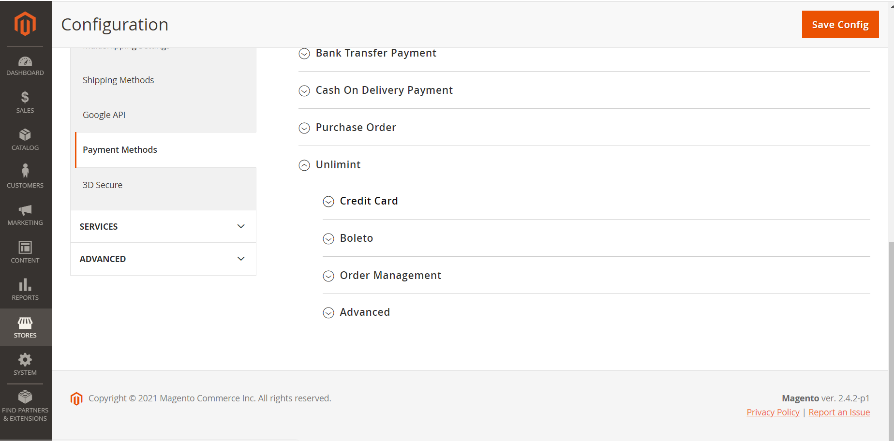

* If you don't see **Unlimint** - please reinstall the plugin again

9. The Unlimint Magento 2 plugin was successfully installed.

## Configuration

This process explains how to set up and configure the Magento plugin to accept payments in supported payment methods

### Basic settings

1. Log in into Admin panel of Unlimint Magento plugin (using your admin credentials)

2. Navigate to Stores > Configuration and under the **Sales** section, click the **Payment Methods**. From here, you can configure the Unlimint payment methods

3. To set up the credentials go to Unlimint > Credentials.
 * Set **Terminal code**, **terminal password**, **callback secret** values - it's merchant credentials for Unlimint APIv3 (how to obtain credentials see [here](https://www.unlimint.com/integration/))
 * Test environment:
    * Set to **Yes** for Sandbox environment (for test purposes)
    * Set to **No** for Production environment

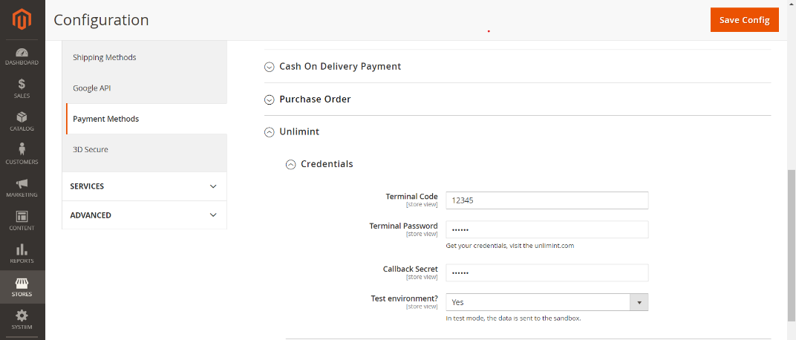

4. With your credentials filled in, you need to enable payment methods in Magento plugin. (for now it's Credit Card and Boleto)
 * First, access the methods you want to enable by Unlimint support (it's a part of merchant onboarding process - see [here](https://www.unlimint.com/integration/))

4.1. To enable payments via **Credit Card** do the following steps:
 * Set **Enabled** to **Yes**
 * **Payment title** - Fill in the name of the payment method, will be presented for the customer in checkout
 * **Capture payment:**
 * Set to **Yes** - for completing payment automatically (one-phase payment),
 * Set to **No** for two-phases payment: the amount will not be captured but only blocked.
   
 With **No** option selected payments will be captured manually from Admin Panel (see **Capture payment** below) or automatically in 7 days from the time of creating the preauthorized transaction.

 * **Checkout position** - This setting value is the position of the payment method for the customer in checkout
 * **Ask CPF** - set to **Yes** if you require CPF (Brazilian Tax Id) of your customer in checkout
   
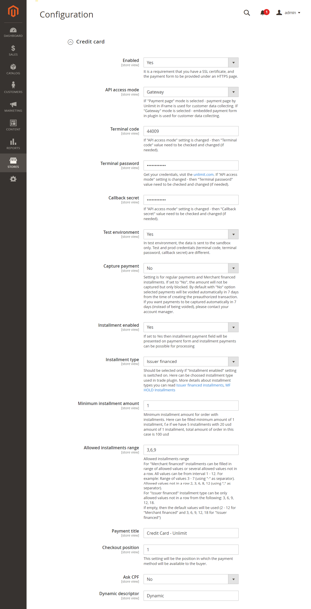

4.2. To enable payments via Boleto

 * Set **Enabled** to **Yes**
 * **Payment title** - Fill in the name of the payment method, will be presented for the customer in checkout
 * **Checkout position** - This setting value is the position of the payment method for the customer in checkout

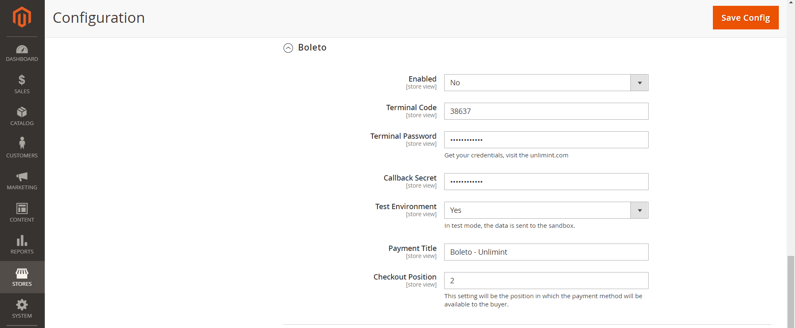

That's it! The selected payment methods are successfully enabled in the checkout.

4.3. Order statuses and refunds settings

Mapping of the order statuses is set by default and you need to change it ONLY if you have yours custom status flow (not recommended to change).

**Refund payment**: by default is set to **Yes**, it will be set to **No** - Refunds (Credit Memos) will be unavailable.

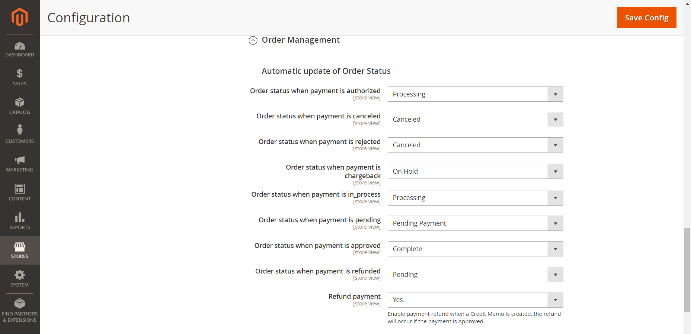

4.4. Advanced settings - Developer Options

**Log to file** - There is a setting about Magento plugin system log (cardpay.log), this log file contains the plugin debug information, communication errors between plugin front-end and back-end.

By default, it's set to **Yes**. If it will be set to **No** - cardpay.log file won't be created.

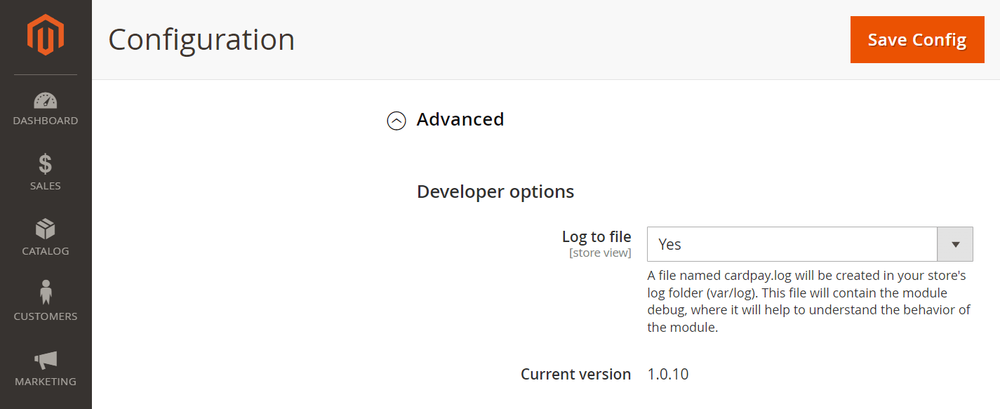

### Payment notification configuration

This process will explain how to set up order statuses for payment notifications:

1. Log in the Unlimint’s [Merchant account](https://cardpay.com/ma) with your merchant creds (Obtaining of merchant creds is a part of merchant onboarding process - see details [here](https://www.unlimint.com/integration/))
2. Go to Wallet Settings and click on the Wallet’s ID. (Settings / Wallet settings /choose specific wallet id /Callbacks /JSON callback URL
3. Fill the JSON Callback URL field with:

`https://<store domain>/cardpay/notifications/creditcard`

The notification statuses have been successfully configured.

## Supported post payment operations

Unlimint Magento 2 plugin supports the following post-payment operations:

 * Cancellation(void) / Capture of the preauthorized payment
 * Refund (Credit Memo) of the payment
 
### Cancellation (void)/Capture of the payment

Cancellation (void)/capture of the payment only works for **Credit card** payment method.
And it is available only for orders were paid with payment method configured with **Capture payment** setting is set to **No**. 
If **Capture payment** is set to **Yes -** an order is complete, you can only refund the payment by creating a **Credit Memo.**

#### Capture of the payment

For Capture of the preathorized payment navigate to Orders and choose the Order in status **Payment review**

After that click **Accept payment** and click **OK** in pop-up window.

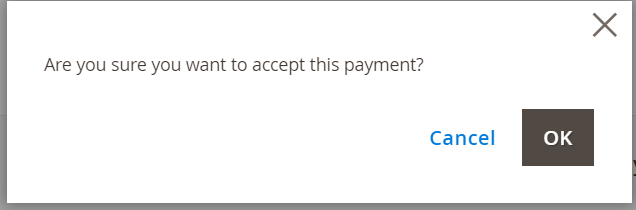

After this action order status is changed to **Processing.**

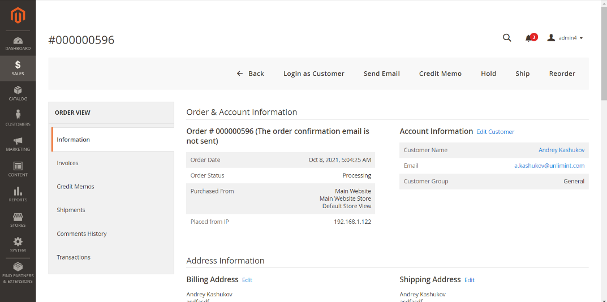

And status of invoice for this order is changed to **Paid**

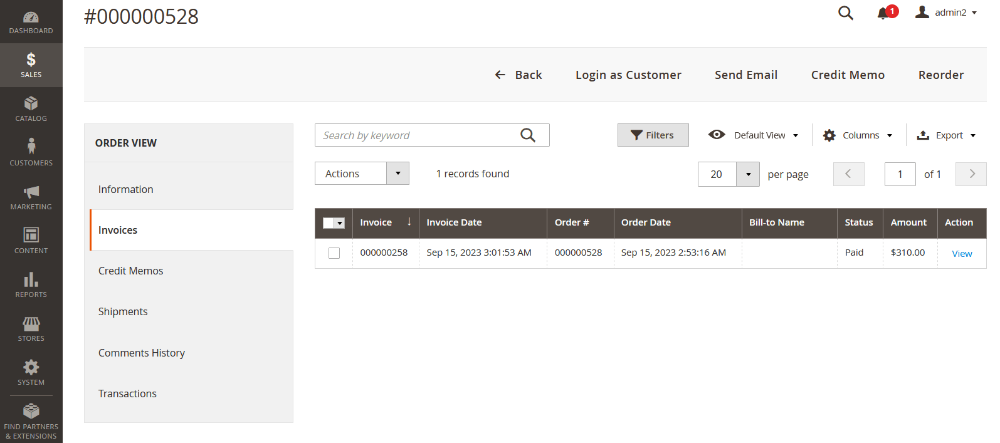

#### Cancel (void) the payment

For cancel (void) the payment navigate to Orders and choose the Order in status **Payment review**.

After that click **Deny payment** and click **OK** in pop-up window

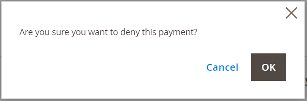

Order status is changed to **Canceled**

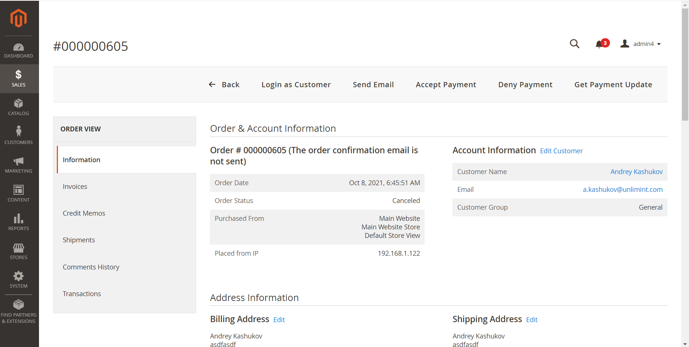

### Refund (Credit Memo) (online refund)

**Refund (Credit memo)** operation is supported only with payment method **Credit Card**

For creating a **Refund** navigate to Orders and choose any order in status **Processing**

Then in left navigation panel **Order view** navigate to **Invoices**

**Credit memo** in invoices is available only if this order has at least one created invoice.

Then choose the invoice and click **View** action in the invoice table of this order

In **Order and Account Information** click the **Credit Memo**

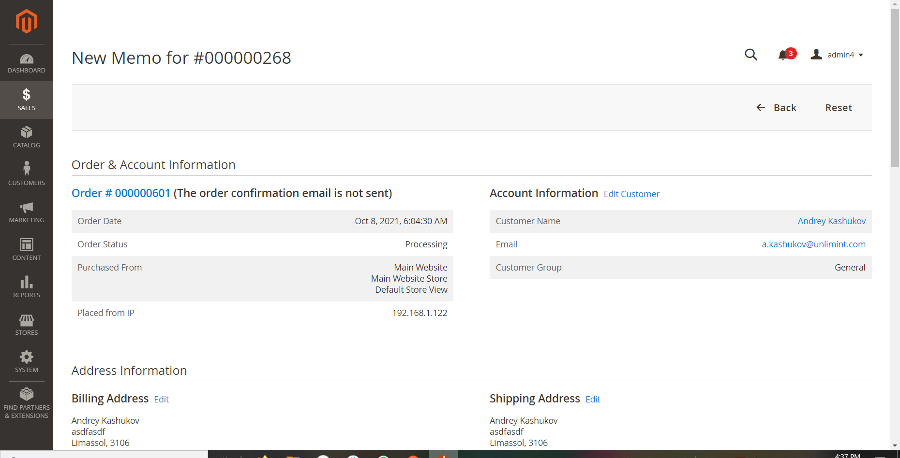

And here click the **Refund** button

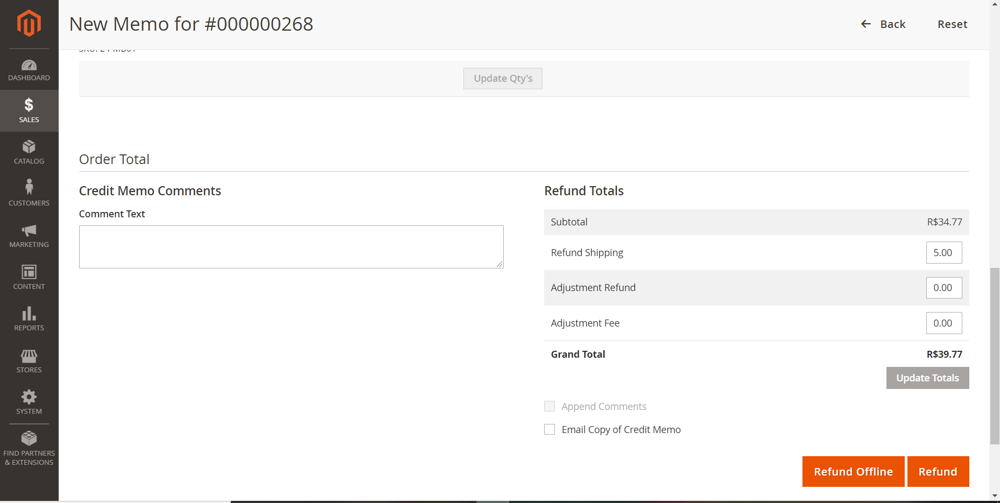

After succesfull refund status of the order is changed to **Closed**

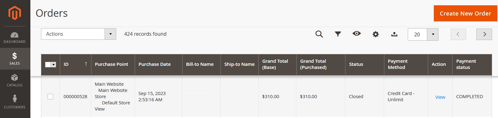

And after successfull refund is created new **Credit Memo**

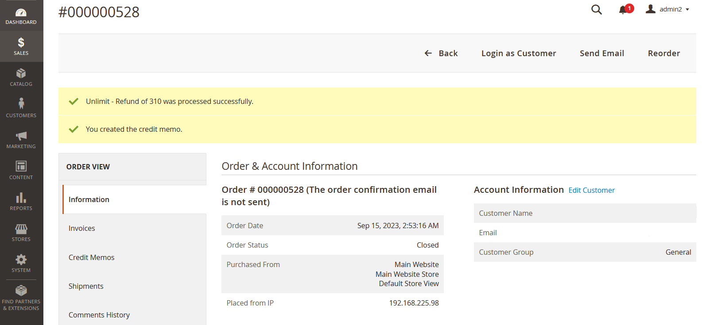

### Refund offline

**Refund offline** is the operation then refund don't created online and amount of order should be returned manually in offline with cash only.

**Refund offline** is possible for all supported payment methods.

For creation **Refund offline** please navigate to the Orders - choose the Order for the refund offline.

Then Click **Credit Memo**

In pop-up window click the **OK** for confirm refund offline operation.

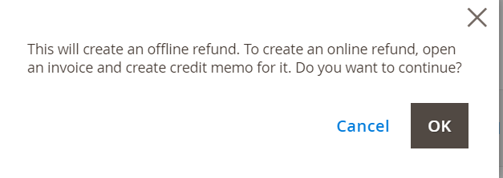**

After that you create the new credit memo.

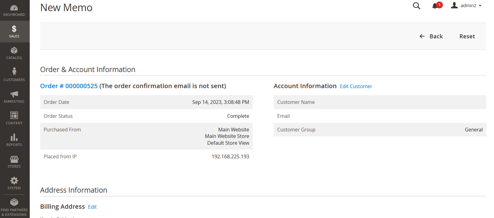

And push the button **Refund offline**

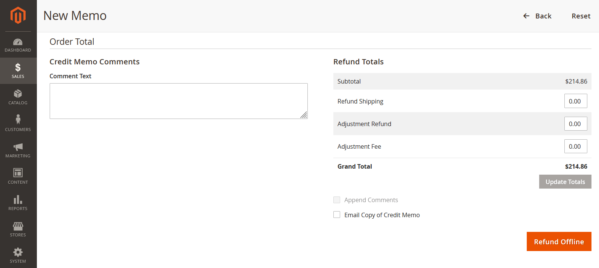

After refund offline order status is changed to "Closed".
