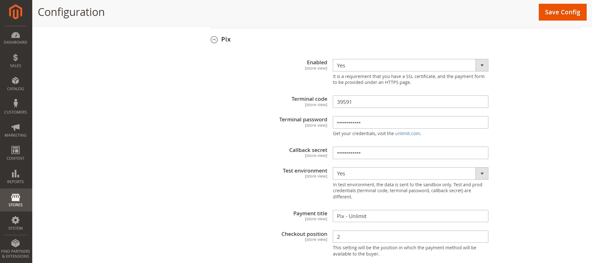
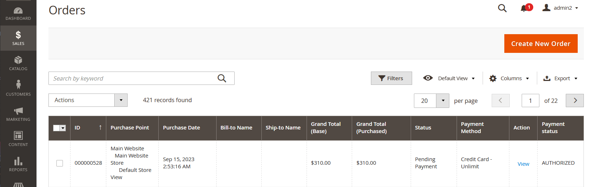
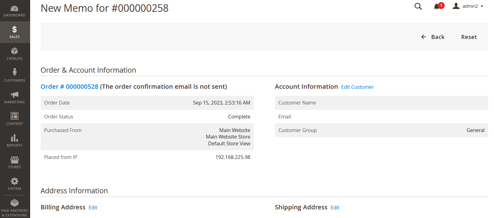

# Unlimit Magento plugin

## Overview

Unlimit Magento 2 plugin allows merchants to make payments and refunds (credit memos) using the Magento 2 platform.

Additionally, the plugin supports cancellation (void) transactions and payment capture for preauthorized payments.

Unlimit Magento 2 plugin is able to work in following modes:
* Gateway mode
* Payment Page mode

### System Requirements

Unlimit’s Magento 2 plugin is open-source and compatible with:

* Magento Open Source 2.4.2 and 2.4.3
* PHP 7.x in accordance with the
  official [Magento 2 specification](https://experienceleague.adobe.com/docs/commerce-operations/installation-guide/system-requirements.html?lang=en)

### Supported payment methods

| Payment method          | Country        | Payment | Installment | Void/Cancel | Refund |
|-------------------------|----------------|---------|-------------|-------------|--------|
| Bank сard (Credit Card) | Global         | Yes     | Yes         | Yes         | Yes    |
| Boleto                  | Brazil         | Yes     | No          | No          | No     |
| Google Pay              | Global         | Yes     | No          | No          | No     |
| MB WAY                  | Portugal       | Yes     | No          | No          | No     |
| Multibanco              | Portugal       | Yes     | No          | No          | No     |
| PayPal                  | Global         | Yes     | No          | No          | No     |
| Pix                     | Brazil         | Yes     | No          | No          | No     |
| SEPA Instant            | Europe         | Yes     | No          | No          | No     |
| SPEI                    | Mexico         | Yes     | No          | No          | No     |

### Supported localizations

- Portuguese (PT)
- Spanish (ES)

## Installation

To install the Magento 2 plugin, follow these steps:

1. Download the latest version of the Magento 2 plugin from the [repository](https://github.com/cardpay/magento-plugin).

2. Navigate to your Magento installation's root directory.

3. Place the **Cardpay** folder into the **app/code** directory.

4. Update Magento with the new modules by running the following command:

   `bin/magento setup:upgrade`

5. Clean the Magento cache with the following command:

   `bin/magento cache:clean`

6. If your store is in production mode, regenerate the static files:

   `bin/magento setup:static-content:deploy`

7. If you encounter folder permission issues when accessing the store, review your permissions
   following [the official Magento recommendations](https://experienceleague.adobe.com/docs/commerce-operations/installation-guide/overview.html?lang=en).

8. Verify the successful installation of the plugin:

* Log in to the **Admin panel** of the Unlimit Magento plugin using your admin credentials.

* Navigate to **Stores > Configuration** and under the **Sales** section, click the **Payment Methods**. Here, you
  should find  **Unlimit** and its settings.

* If you don't see **Unlimit**, please consider reinstalling the plugin.

This will ensure the successful installation of the Unlimit Magento 2 plugin.

## Configuration

This process explains how to set up and configure the **Magento plugin** to accept payments via supported payment
methods.

### Basic settings

1. Log in to the **Admin panel** of the Unlimit Magento plugin (using your admin credentials).

2. Navigate to **Stores > Configuration** and under the **Sales** section, click **Payment Methods**. Here, you can
   configure the Unlimit payment methods.

3. To enable payment methods in the **Magento** plugin:
    - Bank сard (Credit Card)
    - Boleto
    - Google Pay
    - MB WAY
    - Multibanco
    - PayPal
    - Pix
    - SEPA Instant
    - SPEI

First, access the methods you want to enable via Unlimit support (it's a part of merchant onboarding process -
see [here](https://www.unlimit.com/integration/)).

#### **Credit Card**
To enable payments via **Credit Card** complete the following steps:

* Set **Enabled** to **Yes** (by default it's disabled).
* **API access mode:**
    * Set to **Payment page** for cases when the payment page by Unlimit in iFrame is used for customer data collecting.
    * Set to **Gateway** for cases when embedded payment form in plugin is used for customer data collecting.
* Set **Terminal code**, **Terminal password**, **Callback secret** values - it should be merchant credentials in
  Unlimit APIv3 for this payment method (how to obtain credentials see [here](https://www.unlimit.com/integration/))
* **Test environment:**
    * Set to **Yes** for Sandbox environment (for test purposes).
    * Set to **No** for Production environment.
* **Capture payment:**
    * Set to **Yes** - for completing payment automatically (one-phase payment).
    * Set to **No** - for two-phases of payment: the amount will not be captured but only blocked.
* **Installment enabled:** - this setting enables installment payments
    * Set to **Yes** - installment payments are enabled.
    * Set to **No** - installment payments aren't enabled.
* **Installment type:** - installment type used in plugin
    * Set to **Issuer financed** - for using Issuer financed installments - for more details about it,
      see [API documentation](https://integration.unlimit.com/doc-guides/yjri881uncqhc-overview#issuer-financed-if).
    * Set to **Merchant financed** - for using Merchant financed installments - for more details about it,
      see [API documentation](https://integration.unlimit.com/doc-guides/yjri881uncqhc-overview#merchant-financed-mf_hold).
* **Minimum installment amount:** - minimum amount of 1 installment.
* **Allowed installments range:** - allowed installments range:
    * 1-12 for Merchant financed.
    * 3, 6, 9, 12, 18 for Issuer financed.
* **Payment title** - fill in the name of the payment method, which will be presented for the customer in checkout.
* **Checkout position** - this setting value is the position of the payment method for the customer in checkout.
* **Ask CPF** - set to **Yes** if you require **CPF (Brazilian Tax Id)** of your customers during checkout.
* **Dynamic descriptor** - in this setting is described dynamic_descriptor parameter in payment request - for more
  details about it,
  see [API documentation](https://integration.unlimit.com/api-reference/b5e0a98548e2b-payment-request-payment-data).

#### **Boleto**
To enable payments via **Boleto** complete the following steps:

* Set **Enabled** to **Yes** (by default it's disabled).
* Set **Terminal code**, **Terminal password**, **Callback secret** values - it should be merchant credentials in
  Unlimit APIv3 for this payment method (how to obtain credentials see [here](https://www.unlimit.com/integration/))
* **Test environment:**
    * Set to **Yes** for Sandbox environment (for test purposes).
    * Set to **No** for Production environment.
* **Payment title** - fill in the name of the payment method, which will be presented for the customer in checkout.
* **Checkout position** - this setting value is the position of the payment method for the customer in checkout.

#### **Google Pay**
To enable payments via **Google Pay** complete the following steps:

* Set **Enabled** to **Yes** (by default it's disabled).
* Set **Terminal code**, **Terminal password**, **Callback secret** values - it should be merchant credentials in
  Unlimit APIv3 for this payment method (how to obtain credentials see [here](https://www.unlimit.com/integration/))
* **Google merchant ID** - Merchant ID, provided by Google.
* **Test environment:**
    * Set to **Yes** for Sandbox environment (for test purposes).
    * Set to **No** for Production environment.
* **Payment title** - fill in the name of the payment method, which will be presented for the customer in checkout.
* **Checkout position** - this setting value is the position of the payment method for the customer in checkout.

#### **MB WAY**
To enable payments via **MB WAY** complete the following steps:

* Set **Enabled** to **Yes** (by default it's disabled)
* **API access mode:**
    * Set to **Payment page** for cases when payment page by Unlimit in iFrame is used for customer data collecting.
    * Set to **Gateway** for cases when embedded payment form in plugin is used for customer data collecting.
* Set **Terminal code**, **Terminal password**, **Callback secret** values - it should be merchant credentials in
  Unlimit APIv3 for this payment method (how to obtain credentials see [here](https://www.unlimit.com/integration/))
* **Test environment:**
    * Set to **Yes** for Sandbox environment (for test purposes).
    * Set to **No** for Production environment.
* **Payment title** - fill in the name of the payment method, which will be presented for the customer in checkout.
* **Checkout position** - this setting value is the position of the payment method for the customer in checkout.

#### **Multibanco**
To enable payments via **Multibanco** complete the following steps:

* Set **Enabled** to **Yes** (by default it's disabled)
* **API access mode:**
    * Set to **Payment page** for cases when payment page by Unlimit in iFrame is used for customer data collecting.
    * Set to **Gateway** for cases when embedded payment form in plugin is used for customer data collecting.
* Set **Terminal code**, **Terminal password**, **Callback secret** values - it should be merchant credentials in
  Unlimit APIv3 for this payment method (how to obtain credentials see [here](https://www.unlimit.com/integration/))
* **Test environment:**
    * Set to **Yes** for Sandbox environment (for test purposes).
    * Set to **No** for Production environment.
* **Payment title** - fill in the name of the payment method, which will be presented for the customer in checkout.
* **Checkout position** - this setting value is the position of the payment method for the customer in checkout.

#### **PayPal**
To enable payments via **PayPal** complete the following steps:

* Set **Enabled** to **Yes** (by default it's disabled).
* **API access mode:**
    * Set to **Payment page** for cases when payment page by Unlimit in iFrame is used for customer data collecting.
    * Set to **Gateway** for cases when embedded payment form in plugin is used for customer data collecting.
* Set **Terminal code**, **Terminal password**, **Callback secret** values - it should be merchant credentials in
  Unlimit APIv3 for this payment method (how to obtain credentials see [here](https://www.unlimit.com/integration/))
* **Test environment:**
    * Set to **Yes** for Sandbox environment (for test purposes).
    * Set to **No** for Production environment.
* **Payment title** - fill in the name of the payment method, which will be presented for the customer in checkout.
* **Checkout position** - this setting value is the position of the payment method for the customer in checkout.

#### **Pix**
To enable payments via **Pix** complete the following steps:

* Set **Enabled** to **Yes** (by default it's disabled).
* Set **Terminal code**, **Terminal password**, **Callback secret** values - it should be merchant credentials in
  Unlimit APIv3 for this payment method (how to obtain credentials see [here](https://www.unlimit.com/integration/))
* **Test environment:**
    * Set to **Yes** for Sandbox environment (for test purposes).
    * Set to **No** for Production environment.
* **Payment title** - fill in the name of the payment method, which will be presented for the customer in checkout.
* **Checkout position** - this setting value is the position of the payment method for the customer in checkout.

#### **SEPA Instant**
To enable payments via **SEPA Instant** complete the following steps:

* Set **Enabled** to **Yes** (by default it's disabled).
* **API access mode:**
    * Set to **Payment page** for cases when payment page by Unlimit in iFrame is used for customer data collecting.
    * Set to **Gateway** for cases when embedded payment form in plugin is used for customer data collecting.
* Set **Terminal code**, **Terminal password**, **Callback secret** values - it should be merchant credentials in
  Unlimit APIv3 for this payment method (how to obtain credentials see [here](https://www.unlimit.com/integration/))
* **Test environment:**
    * Set to **Yes** for Sandbox environment (for test purposes).
    * Set to **No** for Production environment.
* **Payment title** - fill in the name of the payment method, which will be presented for the customer in checkout.
* **Checkout position** - this setting value is the position of the payment method for the customer in checkout.

#### **SPEI**
To enable payments via **SPEI** complete the following steps:

* Set **Enabled** to **Yes** (by default it's disabled).
* **API access mode:**
    * Set to **Payment page** for cases when payment page by Unlimit in iFrame is used for customer data collecting.
    * Set to **Gateway** for cases when embedded payment form in plugin is used for customer data collecting.
* Set **Terminal code**, **Terminal password**, **Callback secret** values - it should be merchant credentials in
  Unlimit APIv3 for this payment method (how to obtain credentials see [here](https://www.unlimit.com/integration/))
* **Test environment:**
    * Set to **Yes** for Sandbox environment (for test purposes).
    * Set to **No** for Production environment.
* **Payment title** - fill in the name of the payment method, which will be presented for the customer in checkout.
* **Checkout position** - this setting value is the position of the payment method for the customer in checkout.

That's it! The selected payment methods are successfully enabled in the checkout.

#### **Advanced settings - Developer Options**

* **Log to file** - it's a setting about the Magento plugin system log (cardpay.log), this log file contains the plugin
  debug information, communication errors between plugin front-end and back-end.

By default, it's set to **Yes**. If it's set to **No** - cardpay.log file won't be created.

### Payment notification configuration

This process will explain how to set up order statuses for payment notifications:

1. Log in the Unlimit’s [Merchant account](https://unlimit.com/ma) with your merchant credentials (Obtaining of merchant
   credentials is a part of merchant onboarding process - see details [here](https://www.unlimit.com/integration/))
2. Go to **Wallet Settings** and click on the Wallet’s ID. (Settings /  Wallet settings / choose specific Terminal code / Callbacks / JSON callback URL)
3. Fill the JSON callback URL field with:

`https://<store domain>/cardpay/notifications/creditcard`

The notification statuses have been successfully configured.

## Supported post-payment operations

The Unlimit Magento 2 plugin supports the following post-payment operations:

* Cancellation (void) / Capture of the preauthorized payment.
* Refund (Credit Memo) of the payment (online and offline).

### Cancellation (void) / Capture of the payment

Cancellation (void)/capture of the payments only works for the **Credit card** payment method. And it's available only
for orders which were paid with a payment method configured with the **Capture payment** setting set to **No**.

If **Capture payment** is set to **Yes -** an order will be completed automatically, and you can only refund the payment
by creating a **Credit Memo**

#### Capture of the payment

To capture the preauthorized payment, navigate to **Orders** and select the **Order**.

Orders have two statuses:

* "Status" - general order status in Magento
* "Payment status" - only status of order payment

To create the invoice for this order manually, click on **Invoice**

Check all the information in the invoice, edit the quantity of the items if needed (you can reduce the quantity of the
items and choose **Complete order partially**).

Then click **Submit invoice.**

After this action, you should click **Ship** in Order.

Click **New shipment screen** and review all information about the shipment, adding shipment information if needed,
before clicking **Submit shipment**

Then the status of the order is changed to **Complete**.

And the status of the invoice for this order is changed to **Paid**.

#### Cancel (void) the payment

To cancel (void) the payment, go to **Orders** and select the  **Order** you wish to cancel (void) payment.

Then click **Cancel**. In the pop-up window, click **OK**

The order status is changed to **Canceled**

### Refund (Credit Memo) (online refund)

The **Refund (Credit memo)** operation is supported only with the **Credit Card** payment method.

To create a **Refund**, navigate to **Orders** and select any **Order** in **Processing** or **Complete**
status.

Then in the left navigation panel, select **Order view** to navigate to **Invoices**.

**Credit memo** in invoices is available only if this order has at least one created invoice.

Choose the invoice and click **View** in the invoice table of this order.

In **Order and Account Information**, click the **Credit Memo**.

Finally, click the **Refund** button.

After successfully completing the refund, a new **Credit Memo** is created.

And the status of the order is changed to **Closed**.

### Refund offline

**Refund offline** is the operation when a refund isn't created online, and the amount of the order should be returned
manually (offline) with cash only.

**Refund offline** is possible for all supported payment methods in the **Unlimit Magento plugin**.

To create a **Refund offline**, please go to **Orders** and select the **Order** for the offline refund.

Then Click **Credit Memo**

In the pop-up window, click **OK** to confirm the **Refund offline** operation.

After that, you'll create a new **Credit memo**.

Then click the **Refund offline** button.

After completing the **Refund offline** the order status is changed to **Closed.**
