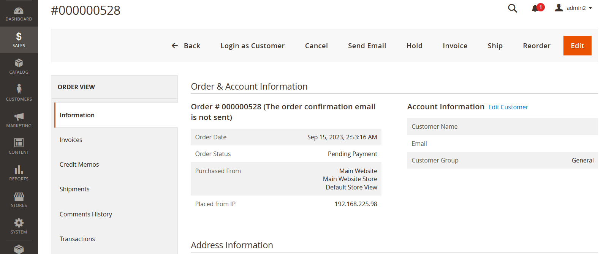
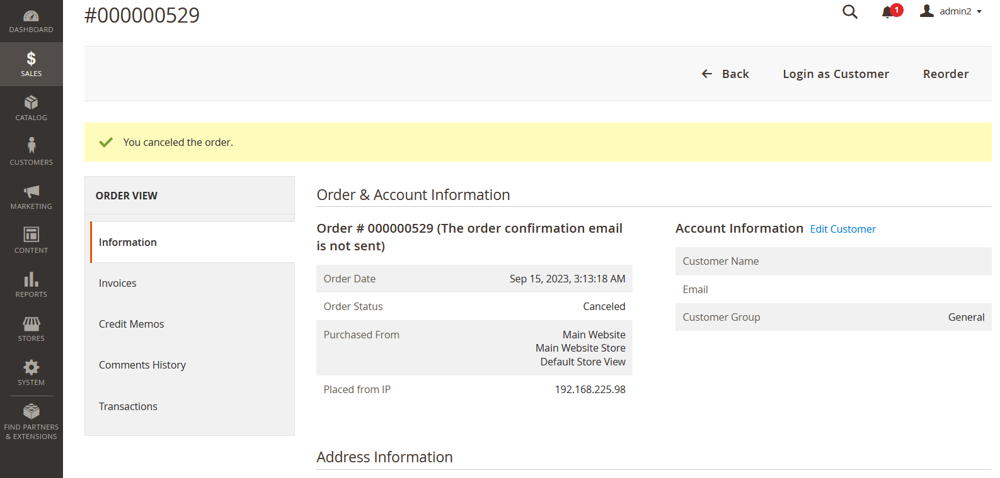
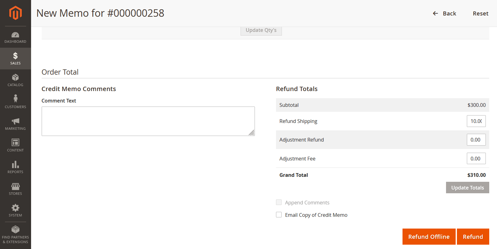

# Unlimint Magento plugin
## Overview

Unlimint Magento 2 plugin allows merchants to make payments and refunds (credit memos) using the Magento 2 platform.

Also, for preauthorised payments  the plugin supports cancellation (void) transactions and capturing of the payments.

Unlimint Magento 2 plugin works with accessible Gateway and Payment Page modes.

### Requirements

Unlimint’s Magento 2 plugin is an open-source and supports: 

* Magento Open Source 2.4.2, 2.4.3
* PHP 7.x according to official [Magento 2 specification ](https://devdocs.magento.com/guides/v2.4/install-gde/system-requirements.html)

### Supported payment methods

- Bank сard (Credit Card)
- Boleto
- Pix

### Supported localizations

- Portuguese (PT)
- Spanish (ES)

## Installation

The installation process will explain how to install the Magento 2 plugin, detailed below:

1. Download the latest version of Magento 2 plugin from Unlimint's Github [repository](https://github.com/cardpay/magento-plugin)

2. Go to Magento’s root directory.

3. Copy the **Cardpay** folder inside the **app/code** directory.

4. Then update Magento with new modules:
        
   `bin/magento setup:upgrade`
        
5. Execute the command to clean the Magento cache:
        
   `bin/magento cache:clean`
        
6. When the store is in production mode, it's necessary to generate the static files again:

   `bin/magento setup:static-content:deploy`

7. If you have problems with folder permissions when accessing the store, you must review your permissions according to [the official Magento recommendations](https://devdocs.magento.com/guides/v2.4/install-gde/prereq/file-sys-perms-over.html)

8. Check the plugin has successfully installed

* Log in to the **Admin panel** of Unlimint Magento plugin (using your admin credentials)

* Navigate to **Stores > Configuration** and under the **Sales** section, click the **Payment Methods**, and then you’ll see **Unlimint** and the settings of it.

* If you don't see **Unlimint** - please reinstall the plugin again

9. The Unlimint Magento 2 plugin was successfully installed

## Unit tests (optional)

For execution unit tests in **Magento** plugin, run the command in the console:

 `php ./vendor/phpunit/phpunit/phpunit ./app/code/Cardpay/Core/Test/Unit`
   
This command executes all tests from Test/Unit catalogue.

## Configuration

This process explains how to set up and configure the **Magento plugin** to accept payments via supported payment methods

### Basic settings

1. Log in to the **Admin panel** of Unlimint Magento plugin (using your admin credentials)

2. Navigate to **Stores** > **Configuration** and under the **Sales** section, click the **Payment Methods**. From here, you can configure the Unlimint payment methods

3. You need to enable payment methods in **Magento** plugin (Credit Card, Pix and Boleto)

First, access the methods you want to enable via Unlimint support (it's a part of merchant onboarding process - see [here](https://www.unlimint.com/integration/))

3.1. To enable payments via **Credit Card** complete the following steps:

 * Set **Enabled** to **Yes**
 * **API access mode:**
    * Set to **Payment page** for cases when payment page by Unlimint in iFrame is used for customer data collecting
    * Set to **Gateway** for cases when embedded payment form in plugin is used for customer data collecting
 * Set **Terminal code**, **Terminal password**, **Callback secret** values - it should be merchant credentials in Unlimint APIv3 for this payment method (how to obtain credentials see [here](https://www.unlimint.com/integration/))
 * **Test environment:**
    * Set to **Yes** for Sandbox environment (for test purposes)
    * Set to **No** for Production environment
 * **Capture payment:**
   * Set to **Yes** - for completing payment automatically (one-phase payment)
   * Set to **No** - for two-phases of payment: the amount will not be captured but only blocked  
 * **Installment enabled:** - this setting enables installment payments
   * Set to **Yes** - installment payments are enabled
   * Set to **No** - installment payments aren't enabled
* **Installment type:** - installment type used in plugin
   * Set to **Issuer financed** - for using Issuer financed installments  - for more details about it, see [API documentation](https://integration.unlimint.com/#Issuer-financed-(IF))
   * Set to **Merchant financed** - for using Merchant financed installments  - for more details about it, see [API documentation](https://integration.unlimint.com/#Merchant-financed-(MF_HOLD))
* **Minimum installment amount:** - minimum amount of 1 installment
* **Allowed installments range:** - allowed installments range:
   * 1-12 for Merchant financed
   * 3, 6, 9, 12, 18 for Issuer financed
 * **Payment title** - fill in the name of the payment method, which will be presented for the customer in checkout
 * **Checkout position** - this setting value is the position of the payment method for the customer in checkout
 * **Ask CPF** - set to **Yes** if you require **CPF (Brazilian Tax Id)** of your customers during checkout
 * **Dynamic Descriptor** - in this setting is described dynamic_descriptor parameter in payment request - for more details about it, see [API documentation](https://integration.unlimint.com/#PaymentRequestPaymentData)

3.2. To enable payments via **Boleto**

 * Set **Enabled** to **Yes** (by default it's disabled)
 * Set **Terminal code**, **Terminal password**, **Callback secret** values - it should be merchant credentials in Unlimint APIv3 for this payment method (how to obtain credentials see [here](https://www.unlimint.com/integration/))
 * **Test environment:**
    * Set to **Yes** for Sandbox environment (for test purposes)
    * Set to **No** for Production environment
 * **Payment title** - fill in the name of the payment method, which will be presented for the customer in checkout
 * **Checkout position** - this setting value is the position of the payment method for the customer in checkout

3.3. To enable payments via **Pix**

 * Set **Enabled** to **Yes** (by default it's disabled)
 * Set **Terminal code**, **Terminal password**, **Callback secret** values - it should be merchant credentials in Unlimint APIv3 for this payment method (how to obtain credentials see [here](https://www.unlimint.com/integration/))
 * **Test environment:**
    * Set to **Yes** for Sandbox environment (for test purposes)
    * Set to **No** for Production environment
 * **Payment title** - fill in the name of the payment method, which will be presented for the customer in checkout
 * **Checkout position** - this setting value is the position of the payment method for the customer in checkout

That's it! The selected payment methods are successfully enabled in the checkout.

3.4. Order statuses and refunds settings

Mapping of the order statuses is set by default and you need to change it ONLY if you have yours custom order statuses flow (not recommended to change).

**Refund payment**: by default is set to **Yes**. If it's set to **No** - Refunds (Credit Memos) will be unavailable.

**Order statuses for Credit card**

**Order statuses for Pix**

**Order statuses for Boleto**

3.5. Advanced settings - Developer Options

**Log to file** - it's a setting about the Magento plugin system log (cardpay.log), this log file contains the plugin debug information, communication errors between plugin front-end and back-end.

By default, it's set to **Yes**. If it's set to **No** - cardpay.log file won't be created.

### Payment notification configuration

This process will explain how to set up order statuses for payment notifications:

1. Log in the Unlimint’s [Merchant account](https://cardpay.com/ma) with your merchant credentials (Obtaining of merchant credentials is a part of merchant onboarding process - see details [here](https://www.unlimint.com/integration/))
2. Go to **Wallet Settings** and click on the Wallet’s ID. (Settings / Wallet settings /choose specific wallet id /Callbacks /JSON callback URL
3. Fill the JSON callback URL field with:

`https://<store domain>/cardpay/notifications/creditcard`

The notification statuses have been successfully configured.

## Supported post-payment operations

Unlimint Magento 2 plugin supports the following post-payment operations:

 * Cancellation(void) / Capture of the preauthorized payment
 * Refund (Credit Memo) of the payment (online and offline)
 
### Cancellation (void)/Capture of the payment

Cancellation (void)/capture of the payments only works for the **Credit card** payment method.
And it's available only for orders which were paid with payment method configured with **Capture payment** setting set to **No**. 

If **Capture payment** is set to **Yes -** an order will be completed automatically, you can only refund the payment by creating a **Credit Memo**

#### Capture of the payment

For Capture of the preauthorised payment navigate to **Orders** and choose the **Order**.

To create the invoice for this order manually - click on **Invoice**

Check all information in invoice, edit quantity of the items if needed (you can reduce the quantity of the items and **Complete order partially**).

Then click **Submit invoice.**

After this action you should click **Ship** in Order.

Click **New shipment screen** and check all information about shipment, adding shipment information if needed, before clicking **Submit shipment**

Then status of the order is changed to **Complete**.

And status of invoice for this order is changed to **Paid**.

#### Cancel (void) the payment

To cancel (void) the payment, navigate to the **Orders** and choose the **Order** you wish to cancel (void) payment.

And then click **Cancel**. In pop-up window click **OK**

Order status is changed to **Cancelled**

### Refund (Credit Memo) (online refund)

**Refund (Credit memo)** operation is supported only with **Credit Card** payment method.

For creating a **Refund**, navigate to the **Orders** and choose any **Order** in **Processing** status.

Then in left navigation panel select **Order view** to navigate to **Invoices**

**Credit memo** in invoices is available only if this order has at least one created invoice.

Then choose the invoice and click **View** in the invoice table of this order.

In **Order and Account Information** click the **Credit Memo**

And finally click the **Refund** button

After succesfull completion of the refund, the status of the order is changed to **Closed**

And created new **Credit Memo**

### Refund offline

**Refund offline** is the operation when refund isn’t created online and the amount of order should be returned manually (offline) with cash only.

**Refund offline** is possible for all supported payment methods in the **Unlimint Magento plugin**.

To create a **Refund offline**, please navigate to **Orders** and select the **Order** for the refund offline.

Then Click **Credit Memo**

In pop-up window click the **OK** for confirm **Refund offline** operation.

**

After that you create the new **Credit memo**.

And push the button **Refund offline**

After completion of the **Refund offline** order status is changed to **Closed.**
